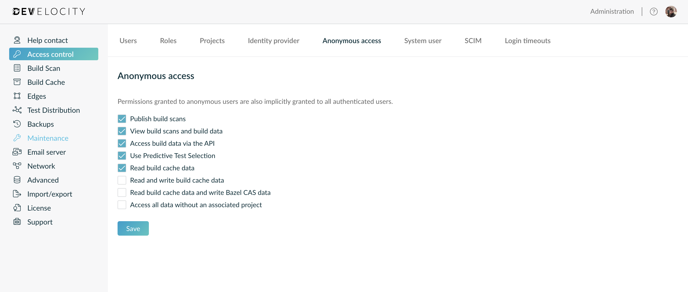
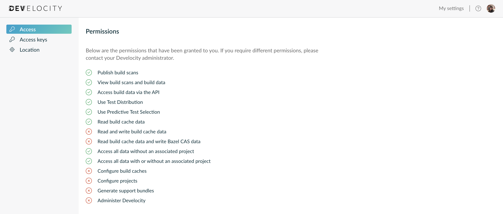

# Access keys

API requests may require [authentication][1].

## Anonymous access

If your Develocity server is configured to allow [anonymous access][2] for permission "Access build data via the API", then an access key is not required to use this library.
This is often the case for a server only accessible from a private network.

## Authenticated access

The library will automatically resolve the access key using the same conventions as official Develocity tooling, in order:

- Environment variable `DEVELOCITY_ACCESS_KEY`
- Environment variable `GRADLE_ENTERPRISE_ACCESS_KEY`
- File `$GRADLE_USER_HOME/.gradle/develocity/keys.properties` (or `~/.gradle/develocity/keys.properties` if `GRADLE_USER_HOME` is not set)
- File `~/.m2/.develocity/keys.properties`

Please check if you already have an access key set up in your build environment for the Develocity server you want to query. The first key for a matching host will be used, if found.

See the official manuals for instructions on how to set up a new access key in one of these locations:

- [Develocity Gradle Plugin User Manual][3]
- [Develocity Maven Extension User Manual][4]
- [Develocity sbt Plugin User Manual][5]
- [Develocity npm Agent User Manual][6]
- [Develocity Python Agent User Manual][7]

### User permissions

To call the API, the user from which the access key was generated must have the "Access build data via the API" permission.

[1]: https://docs.gradle.com/enterprise/api-manual/#access_control
[2]: https://docs.gradle.com/develocity/helm-admin/current/#_anonymous_access
[3]: https://docs.gradle.com/develocity/gradle-plugin/current/#manual_access_key_configuration
[4]: https://docs.gradle.com/develocity/maven-extension/current/#manual_access_key_configuration
[5]: https://gradle.com/help/sbt-plugin-authenticating
[6]: https://gradle.com/help/npm-agent-authenticating
[7]: https://gradle.com/help/python-agent-authenticating
