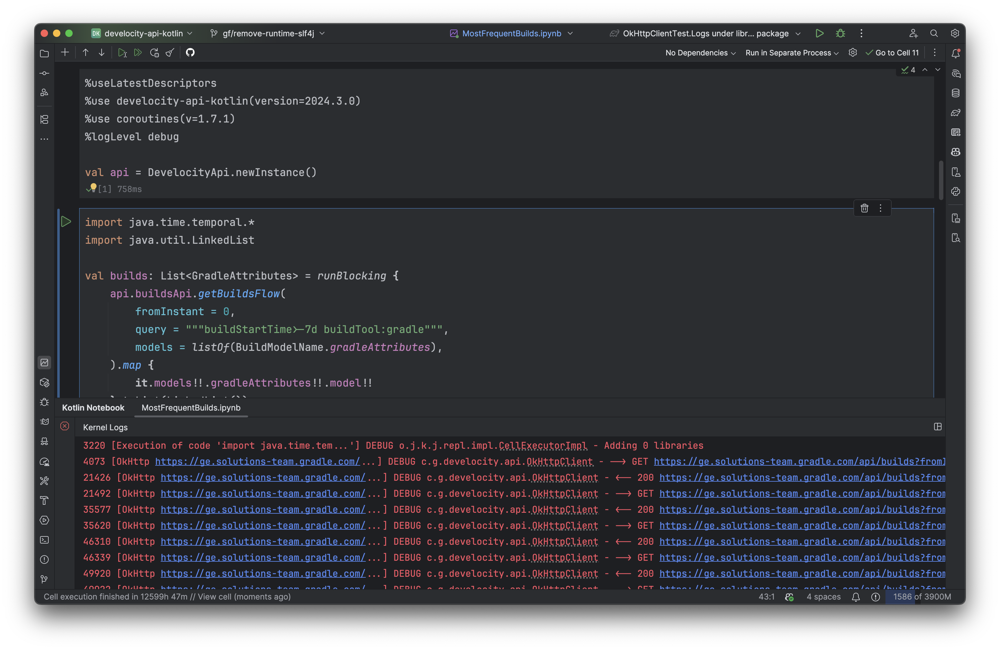

# Logging

This library uses SLF4J for logging, but does not bundle an SLF4J implementation.

## Notebooks

1. Set `%logLevel <level>` in a code cell, e.g., `%logLevel debug`.

Logs appear in the Kotlin Jupyter kernel logs:

- In IntelliJ, view logs in the Kotlin Notebook logs tool window
- In Jupyter and JupyterLab, logs appear in the shell that owns the Jupyter process



## Scripts

1. Add an SLF4J implementation (e.g., `slf4j-simple`, `logback-classic`, etc.)
2. Set the log level for the package `com.gabrielfeo.develocity.api` using your chosen logging framework's configuration

### `simple-logger`

Adding `simple-logger` to your classpath is the easiest way to get logging in scripts. You can do this by adding the following line to your script:

```kotlin
@file:DependsOn("org.slf4j:slf4j-simple:2.0.17")
```

Then set the log level for `com.gabrielfeo.develocity.api` using system properties. For example:

- from script code

```kotlin
@file:DependsOn("com.gabrielfeo:develocity-api-kotlin:2024.3.0")
@file:DependsOn("org.slf4j:slf4j-simple:2.0.17")

System.setProperty("org.slf4j.simpleLogger.log.com.gabrielfeo.develocity", "info")

// ...
```

- from the shebang line

```kotlin
#!/usr/bin/env kotlin -script -J-Dorg.slf4j.simpleLogger.log.com.gabrielfeo.develocity=info
@file:DependsOn("com.gabrielfeo:develocity-api-kotlin:2024.3.0")
@file:DependsOn("org.slf4j:slf4j-simple:2.0.17")

// ...
```

- from `JAVA_OPTS`

```bash
export JAVA_OPTS="-Dorg.slf4j.simpleLogger.log.com.gabrielfeo.develocity=info"
kotlin -script example-script.main.kts
```

## Projects

1. Add an SLF4J implementation (e.g., `slf4j-simple`, `logback-classic`, etc.) to your classpath
2. Set the log level for the package `com.gabrielfeo.develocity.api` using your chosen logging framework's configuration

### `simple-logger`

Adding `simple-logger` to your classpath is the easiest way to get logging in projects. You can do this by adding the following dependency to your build file:

```kotlin
// build.gradle.kts
dependencies {
    implementation("org.slf4j:slf4j-simple:2.0.17")
}
```

Then set the system property when running your application. If using the Gradle `run` task, it can be declared in your build:

```kotlin
tasks.named<JavaExec>("run") {
    // ...
    systemProperty("org.slf4j.simpleLogger.log.com.gabrielfeo.develocity", "debug")
}
```
